<div align="center">


<br>

<a href="https://git.io/typing-svg">
  
</a>

<br><br>


</div>

<br>

## 🪐 Sobre mim

```yaml
sobre_mim:
  nome: "Welson Paiva"
  curso: "Ciência da Computação — 4º período"
  interesses:
    - Inteligência Artificial
    - Desenvolvimento Web
    - Jogos
    - Cybersegurança
    - Design (Figma)
  também_estudo_para: "Concursos públicos (área policial)"
  filosofia: "Aprender construindo, um projeto de cada vez"
```

- 🔭 Atualmente evoluindo em **React**, **JavaScript** e **desenvolvimento web**
- 🛡️ Explorando o universo da **cybersegurança** por conta própria
- 🎮 Apaixonado por **jogos** — tanto jogar quanto pensar em como são construídos
- 🚔 Também me dedico a **concursos públicos**, com foco na área policial
- 🎨 Gosto de unir código e **design**, sempre buscando interfaces bonitas e funcionais
- ⚡ Assim que aprendo algo novo, já quero colocar em prática num projeto

<br>

## 🧠 Stack & Ferramentas

<div align="center">


</div>

<br>

<div align="center">

| 🟢 Confortável | 🟡 Em progresso | 🔵 Base sólida, evoluindo |
|:---:|:---:|:---:|
| HTML5 · CSS3 | JavaScript · React · Tailwind | Python · PHP · MySQL · Figma |

</div>

<br>

## 📊 Estatísticas

<div align="center">



<br><br>



<br><br>


<br><br>


</div>

<br>

## 🐍 Contribuições no tempo

<div align="center">


<br>

## 🏆 Troféus & Conquistas

<div align="center">

</div>

<br>

## 📖 Versículo do dia

<!--BIBLE_VERSE:START-->

<div align="center">

> *"Pois, se pela tua comida se entristece teu irmão, já não andas segundo o amor. Não faças perecer por causa da tua comida aquele por quem Cristo morreu."*
>
> — **Romanos 14:15**

</div>

<!--BIBLE_VERSE:END-->


<br>

## 🌐 Vamos nos conectar

<div align="center">

<a href="mailto:welsonpaiva.40@gmail.com">
  
</a>
<a href="https://github.com/welsonpaiva-40">
  
</a>

</div>

<br>

<div align="center">


<br><br>


</div>
